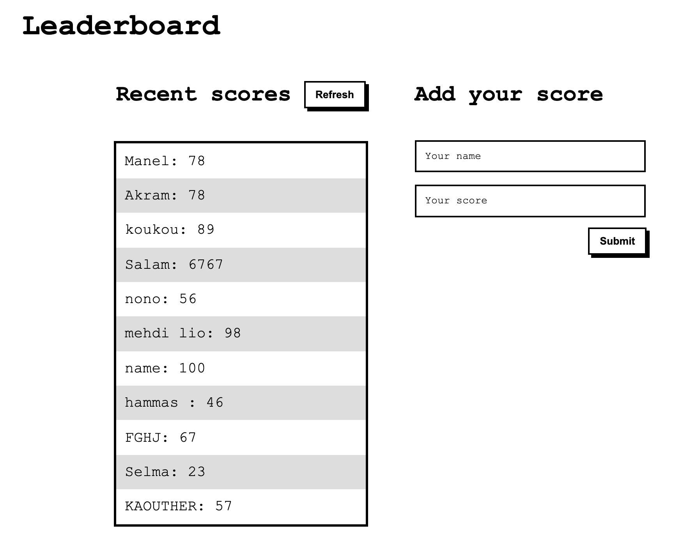

# Leaderboard App

A leaderboard website that displays scores submitted by different players. It also allows you to submit your score. All data is preserved thanks to the external Leaderboard API service.

# Live demo
See the live demo [here](https://selma-belhadj.github.io/leaderboard-setup/)
## Built With

- HTML
- CSS
- JavaScript
- Webpack

## Getting Started

To get a local copy up and running follow these simple example steps.

### Prerequisites

clone repo: `git clone git@github.com:selma-belhadj/leaderboard-setup.git`

then
`cd leaderboard-setup`

### Install

run `npm install` to install dependencies

then run `npm start` to open the webpage on the browser 
## Authors

👤 **Selma Belhadj**

- GitHub: [@selma-belhadj](https://github.com/selma-belhadj)
- Twitter: [@Bel_Selma16](https://twitter.com/Bel_Selma16)
- LinkedIn: [@selma-belhadj](https://www.linkedin.com/in/selma-belhadj/)

## 🤝 Contributing

Contributions, issues, and feature requests are welcome!

Feel free to check the [issues page](../../issues/).

## Show your support

Give a ⭐️ if you like this project!

## Acknowledgments

- Hat tip to anyone whose code was used
- Inspiration
- etc

## 📝 License

Thanks to [Ola](https://github.com/netman5) for this great webpack template.

